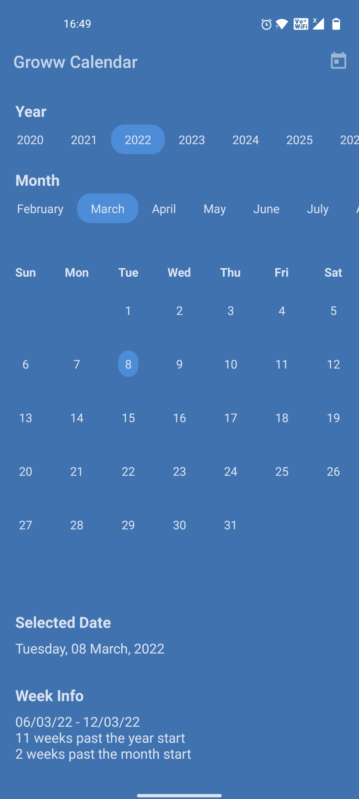
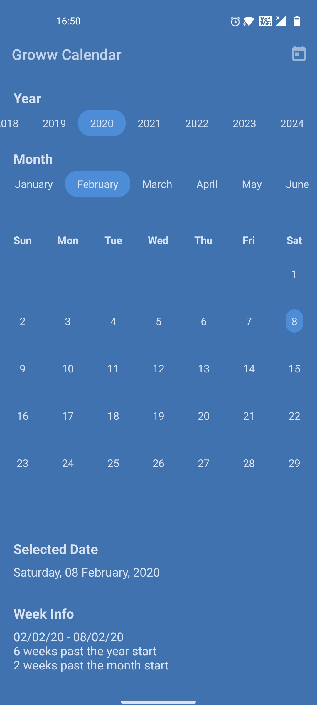

# Groww Task

## Task Description
 ```
Create a calendar application or Calendar lib/Class which exposes all the necessary methods like

1. Shows list of days of current month

2. Able to switch via months, years, go to particular date

3. Create a custom methods to retrieve a week by a given date
```

## Implementation
[Link to the demo video]()

An APK is also attached in the releases section.

### Screenshots
</img>
</img>

## Architecture Overview
```mermaid
 graph TD
	 CalendarLibrary --> MainViewModel --> UI(MainActivity)
 ```

## Calendar Lib Documentation

### Functions

| Name | Summary |
|---|---|
| [getCurrentDay](assets/docs/get-current-day.md) | [jvm]<br>fun [getCurrentDay](assets/docs/get-current-day.md)(): [Int](https://kotlinlang.org/api/latest/jvm/stdlib/kotlin/-int/index.html) |
| [getCurrentMonth](assets/docs/get-current-month.md) | [jvm]<br>fun [getCurrentMonth](assets/docs/get-current-month.md)(): [Int](https://kotlinlang.org/api/latest/jvm/stdlib/kotlin/-int/index.html) |
| [getCurrentYear](assets/docs/get-current-year.md) | [jvm]<br>fun [getCurrentYear](assets/docs/get-current-year.md)(): [Int](https://kotlinlang.org/api/latest/jvm/stdlib/kotlin/-int/index.html) |
| [getDateWithOffset](assets/docs/get-date-with-offset.md) | [jvm]<br>fun [getDateWithOffset](assets/docs/get-date-with-offset.md)(date: [Int](https://kotlinlang.org/api/latest/jvm/stdlib/kotlin/-int/index.html), month: [Int](https://kotlinlang.org/api/latest/jvm/stdlib/kotlin/-int/index.html), year: [Int](https://kotlinlang.org/api/latest/jvm/stdlib/kotlin/-int/index.html)): [Int](https://kotlinlang.org/api/latest/jvm/stdlib/kotlin/-int/index.html) |
| [getDateWithoutOffset](assets/docs/get-date-without-offset.md) | [jvm]<br>fun [getDateWithoutOffset](assets/docs/get-date-without-offset.md)(offsetDate: [Int](https://kotlinlang.org/api/latest/jvm/stdlib/kotlin/-int/index.html), month: [Int](https://kotlinlang.org/api/latest/jvm/stdlib/kotlin/-int/index.html), year: [Int](https://kotlinlang.org/api/latest/jvm/stdlib/kotlin/-int/index.html)): [Int](https://kotlinlang.org/api/latest/jvm/stdlib/kotlin/-int/index.html) |
| [getFormattedDaysInMonth](assets/docs/get-formatted-days-in-month.md) | [jvm]<br>fun [getFormattedDaysInMonth](assets/docs/get-formatted-days-in-month.md)(month: [Int](https://kotlinlang.org/api/latest/jvm/stdlib/kotlin/-int/index.html), year: [Int](https://kotlinlang.org/api/latest/jvm/stdlib/kotlin/-int/index.html)): [List](https://kotlinlang.org/api/latest/jvm/stdlib/kotlin.collections/-list/index.html)&lt;[String](https://kotlinlang.org/api/latest/jvm/stdlib/kotlin/-string/index.html)&gt; |
| [getNumOfDaysInMonth](assets/docs/get-num-of-days-in-month.md) | [jvm]<br>fun [getNumOfDaysInMonth](assets/docs/get-num-of-days-in-month.md)(month: [Int](https://kotlinlang.org/api/latest/jvm/stdlib/kotlin/-int/index.html), year: [Int](https://kotlinlang.org/api/latest/jvm/stdlib/kotlin/-int/index.html)): [List](https://kotlinlang.org/api/latest/jvm/stdlib/kotlin.collections/-list/index.html)&lt;[Int](https://kotlinlang.org/api/latest/jvm/stdlib/kotlin/-int/index.html)&gt; |
| [getNumOfDaysInTheCurrentMonth](assets/docs/get-num-of-days-in-the-current-month.md) | [jvm]<br>fun [getNumOfDaysInTheCurrentMonth](assets/docs/get-num-of-days-in-the-current-month.md)(): [List](https://kotlinlang.org/api/latest/jvm/stdlib/kotlin.collections/-list/index.html)&lt;[Int](https://kotlinlang.org/api/latest/jvm/stdlib/kotlin/-int/index.html)&gt;<br>Calculates the number of days in the current month |
| [getStringFormattedDate](assets/docs/get-string-formatted-date.md) | [jvm]<br>fun [getStringFormattedDate](assets/docs/get-string-formatted-date.md)(date: [Int](https://kotlinlang.org/api/latest/jvm/stdlib/kotlin/-int/index.html), month: [Int](https://kotlinlang.org/api/latest/jvm/stdlib/kotlin/-int/index.html), year: [Int](https://kotlinlang.org/api/latest/jvm/stdlib/kotlin/-int/index.html)): [String](https://kotlinlang.org/api/latest/jvm/stdlib/kotlin/-string/index.html) |
| [getWeekOfMonth](assets/docs/get-week-of-month.md) | [jvm]<br>fun [getWeekOfMonth](assets/docs/get-week-of-month.md)(date: [Int](https://kotlinlang.org/api/latest/jvm/stdlib/kotlin/-int/index.html), month: [Int](https://kotlinlang.org/api/latest/jvm/stdlib/kotlin/-int/index.html), year: [Int](https://kotlinlang.org/api/latest/jvm/stdlib/kotlin/-int/index.html)): [Int](https://kotlinlang.org/api/latest/jvm/stdlib/kotlin/-int/index.html) |
| [getWeekOfYear](assets/docs/get-week-of-year.md) | [jvm]<br>fun [getWeekOfYear](assets/docs/get-week-of-year.md)(date: [Int](https://kotlinlang.org/api/latest/jvm/stdlib/kotlin/-int/index.html), month: [Int](https://kotlinlang.org/api/latest/jvm/stdlib/kotlin/-int/index.html), year: [Int](https://kotlinlang.org/api/latest/jvm/stdlib/kotlin/-int/index.html)): [Int](https://kotlinlang.org/api/latest/jvm/stdlib/kotlin/-int/index.html) |
| [getWeekRange](assets/docs/get-week-range.md) | [jvm]<br>fun [getWeekRange](assets/docs/get-week-range.md)(date: [Int](https://kotlinlang.org/api/latest/jvm/stdlib/kotlin/-int/index.html), month: [Int](https://kotlinlang.org/api/latest/jvm/stdlib/kotlin/-int/index.html), year: [Int](https://kotlinlang.org/api/latest/jvm/stdlib/kotlin/-int/index.html)): [String](https://kotlinlang.org/api/latest/jvm/stdlib/kotlin/-string/index.html) |

### Properties

| Name | Summary |
|---|---|
| [months](assets/docs/months.md) | [jvm]<br>val [months](assets/docs/months.md): [List](https://kotlinlang.org/api/latest/jvm/stdlib/kotlin.collections/-list/index.html)&lt;[String](https://kotlinlang.org/api/latest/jvm/stdlib/kotlin/-string/index.html)&gt; |

<br>
<p align="center">
	Made with ❤ by Rithik Jain
</p>

